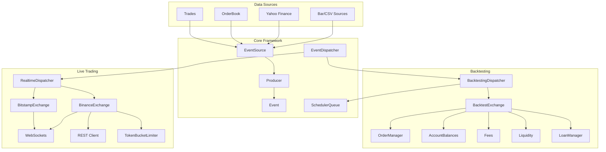

# Basana -- Architecture

## System Design

Basana is built around three fundamental concepts: Events, EventSources, and EventDispatchers. Everything in the framework is driven by events that occur at specific points in time.

## Trading Paradigm & Key Features

| Feature | Support | Details |
|---------|---------|---------|
| Backtesting Approach | Event-driven | BacktestingDispatcher processes events in strict chronological order via priority queue |
| Live Trading | Yes | RealtimeDispatcher processes events as they arrive; Binance and Bitstamp integrations |
| Paper Trading | No | No dedicated paper trading mode; backtesting exchange simulates execution |
| Multi-Asset | Yes | Crypto pairs on Binance (spot, cross-margin, isolated-margin) and Bitstamp |
| Data Feeds | Exchange WebSocket + CSV | Real-time via WebSocket (order book, trades, klines, user data); historical via CSV/Yahoo Finance |
| ML Integration | No | No built-in ML; examples use talipp for technical indicators |
| Risk Management | Custom | Configurable fee models, liquidity/slippage simulation (VolumeShareSlippage), margin lending pools |
| Optimization | No | No built-in optimization or parameter search |
| Execution | Both | Live via Binance/Bitstamp REST APIs; simulated via backtesting exchange with configurable fill models |

## High-Level Architecture



## Component Architecture

```mermaid
graph LR
    subgraph "Event System"
        Event[Event<br/>when: datetime]
        EventSource[EventSource<br/>pop() -> Event]
        Producer[Producer<br/>initialize/finalize]
        FQES[FifoQueueEventSource]
    end

    subgraph "Dispatchers"
        BTD[BacktestingDispatcher<br/>Chronological order]
        RTD[RealtimeDispatcher<br/>Real-time arrival]
        EM[EventMultiplexer<br/>Merge sources]
    end

    subgraph "Backtesting Exchange"
        BExch[Exchange]
        OMgr[OrderManager]
        AccBal[AccountBalances]
        ValMap[ValueMap]
        Lending[Lending Pool]
    end

    subgraph "Binance Integration"
        BinExch[Exchange]
        BinSpot[Spot Trading]
        BinMargin[Margin Trading]
        BinISO[Isolated Margin]
        BinCross[Cross Margin]
        BinWS[WebSocket Manager]
        BinClient[REST Client]
    end

    Event --> EventSource
    EventSource --> Producer
    EventSource --> FQES
    BTD --> EM
    RTD --> EM
    EM --> EventSource
    BExch --> OMgr
    BExch --> AccBal
    AccBal --> ValMap
    BExch --> Lending
    BinExch --> BinSpot
    BinExch --> BinMargin
    BinExch --> BinISO
    BinExch --> BinCross
    BinExch --> BinWS
    BinExch --> BinClient
```

## Key Design Patterns

### Event-Driven Core
Events are the fundamental unit. Every piece of data (bar, trade, order update) is an Event with a `when` timestamp. EventSources produce events; the dispatcher consumes them.

### Active/Passive Split
EventSources are passive (implement `pop()` to return next event). Producers are active (have `initialize()`/`finalize()` lifecycle). This separation allows producers to manage WebSocket connections while sources remain stateless.

### Chronological Ordering
The BacktestingDispatcher uses a priority queue (`SchedulerQueue`) to process events in strict chronological order from multiple sources via an `EventMultiplexer`.

### Configurable Simulation
The backtesting exchange uses pluggable models for fees (`VolumeShareSlippage`), liquidity, and margin lending. This allows realistic simulation without changing strategy code.

## Exchange Abstraction

Both backtesting and live exchanges provide a unified interface:

| Operation | Backtesting | Live (Binance/Bitstamp) |
|-----------|-------------|------------------------|
| Submit order | Simulated execution | REST API call |
| Cancel order | State change | REST API call |
| Balance query | In-memory tracking | REST API call |
| Bar events | CSV/historical data | WebSocket stream |
| Order events | Simulated callbacks | WebSocket user data |

## Binance Integration Detail

The Binance module provides comprehensive access:

| Module | Purpose |
|--------|---------|
| `src/basana/external/binance/spot.py` | Spot trading operations |
| `src/basana/external/binance/margin.py` | Margin trading base |
| `src/basana/external/binance/cross_margin.py` | Cross-margin trading |
| `src/basana/external/binance/isolated_margin.py` | Isolated-margin trading |
| `src/basana/external/binance/order_book.py` | Real-time order book |
| `src/basana/external/binance/order_book_diff.py` | Incremental order book updates |
| `src/basana/external/binance/trades.py` | Trade stream |
| `src/basana/external/binance/klines.py` | Candlestick/kline stream |
| `src/basana/external/binance/user_data.py` | User data stream (orders, balances) |
| `src/basana/external/binance/websocket_mgr.py` | WebSocket lifecycle management |
| `src/basana/external/binance/client/` | REST API client (spot, margin) |

---
## See Also
- [README](README.md) — Project overview and quick start
- [Workflow](workflow.md) — Event flows and processing pipelines
- [State Management](state-management.md) — State lifecycle and data models
- [Development](development.md) — Development guide and best practices
