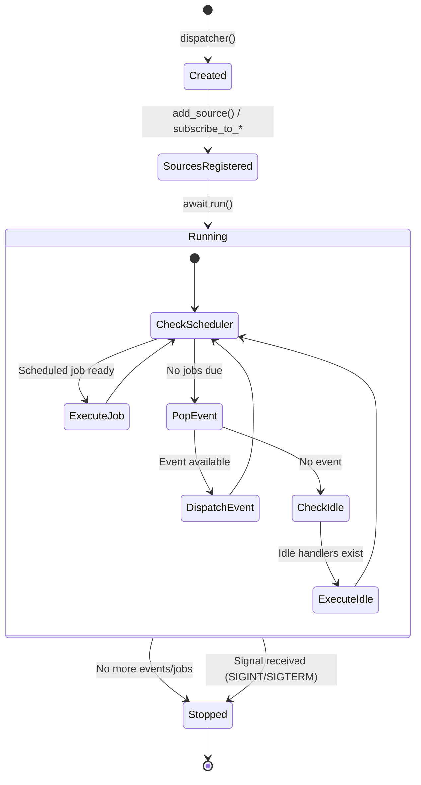
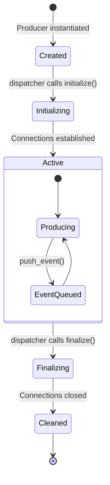
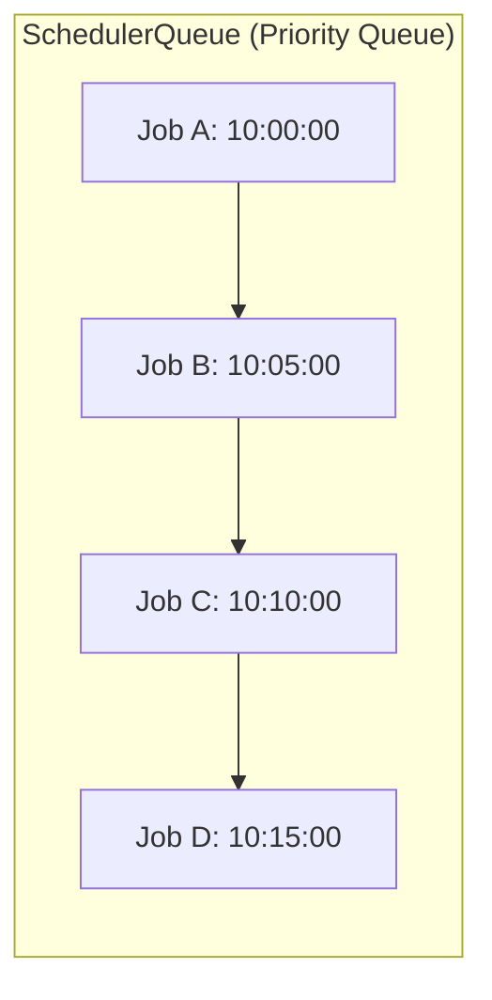
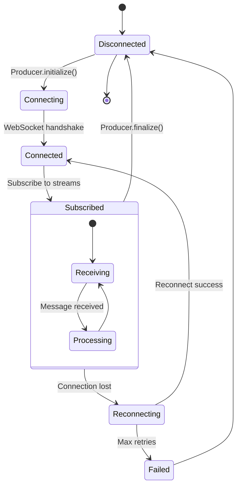
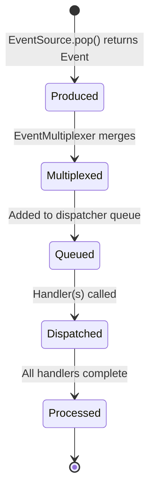

# Basana -- State Management

## Event Dispatcher State Machine



## Backtesting vs Realtime Dispatcher

| Behavior | BacktestingDispatcher | RealtimeDispatcher |
|----------|----------------------|-------------------|
| Event ordering | Strict chronological | As they arrive |
| Time advancement | Jump to next event time | Real wall-clock time |
| Idle behavior | Skip (no waiting) | Execute idle handlers |
| Termination | All sources exhausted | Signal or manual stop |
| Scheduling | Simulated time | Real-time cron |

## Order State Machine

```mermaid
stateDiagram-v2
    [*] --> Accepted: create_*_order()
    
    state "Backtesting" as bt {
        Accepted --> Open: Order registered
        Open --> Filled: Bar price meets condition
        Open --> Cancelled: cancel_order()
    }
    
    state "Live Trading" as live {
        Accepted --> Pending: REST API submitted
        Pending --> Open: Exchange confirms
        Open --> PartiallyFilled: Partial execution
        PartiallyFilled --> Filled: Complete execution
        Open --> Filled: Full execution
        Open --> Cancelled: cancel_order()
        Pending --> Rejected: Exchange rejects
    }
    
    Filled --> [*]
    Cancelled --> [*]
    Rejected --> [*]
```

## Account Balance State

```mermaid
stateDiagram-v2
    [*] --> Initialized: Set initial balances
    
    state "Balance Tracking" as bt {
        [*] --> Available
        Available --> Reserved: Order placed (funds locked)
        Reserved --> Available: Order cancelled (funds released)
        Reserved --> Transferred: Order filled (funds moved)
        Transferred --> Available: New balance settled
    }
    
    state "Margin Tracking" as mt {
        [*] --> NoLoan
        NoLoan --> Borrowed: Insufficient balance + lending pool
        Borrowed --> AccruingInterest: Time passes
        AccruingInterest --> Repaid: Position closed
        Repaid --> NoLoan
    }
```



## Producer Lifecycle



Producers manage external resource lifecycles (WebSocket connections, file handles). The dispatcher calls `initialize()` before processing starts and `finalize()` after processing ends.

## SchedulerQueue

The scheduler uses a min-heap priority queue ordered by execution time:



- `push(when, job)` -- Add job with execution time
- `peek_next_event_dt()` -- Check earliest pending job
- `pop()` -- Remove and return earliest job

All datetimes must be timezone-aware (enforced by assertion).

## WebSocket Connection State (Live Trading)



## Event Flow State



---
## See Also
- [README](README.md) — Project overview and quick start
- [Architecture](architecture.md) — System design and components
- [Workflow](workflow.md) — Event flows and processing pipelines
- [Development](development.md) — Development guide and best practices
