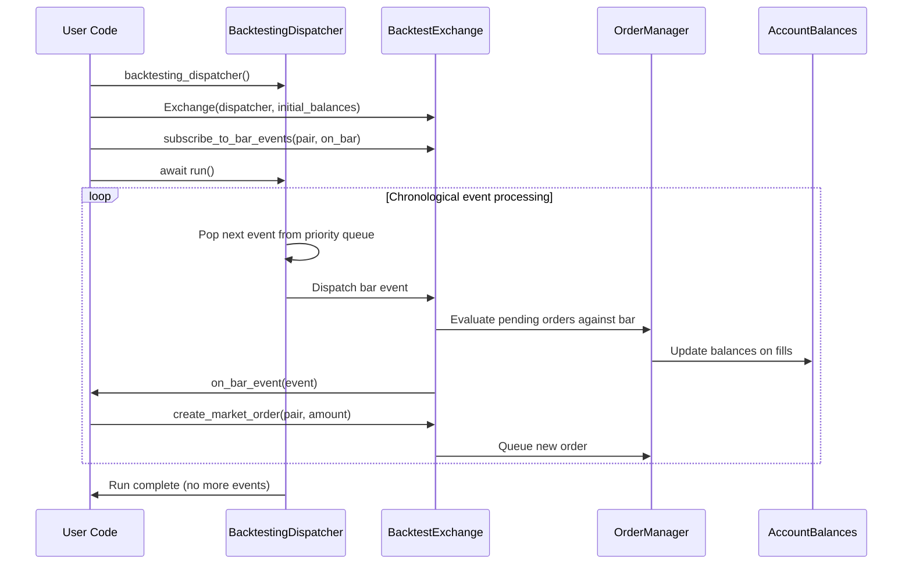
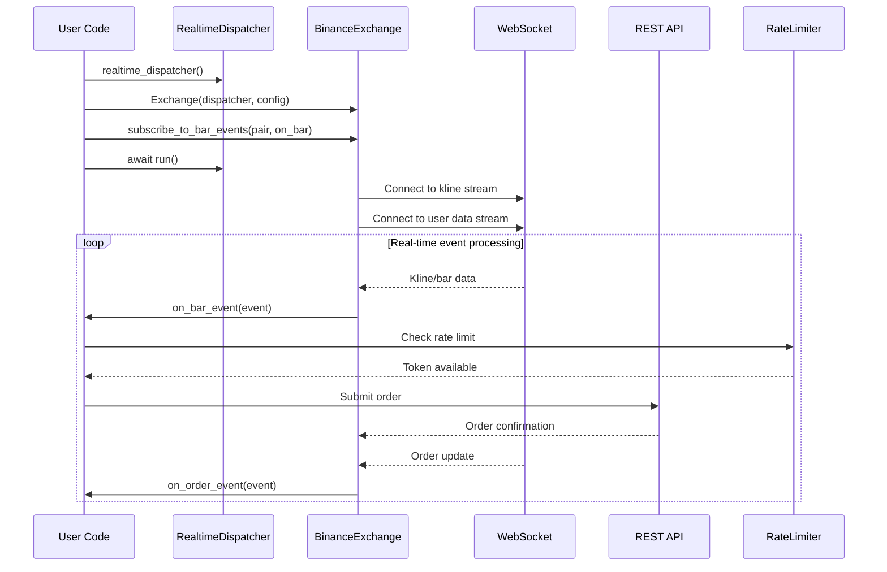
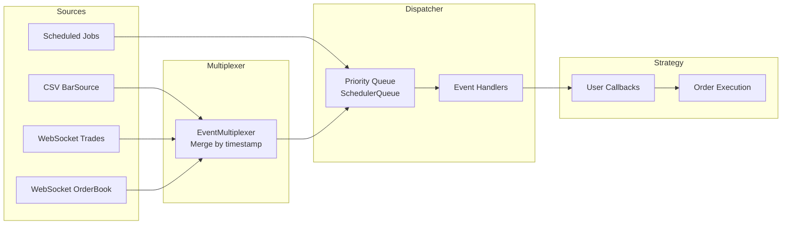
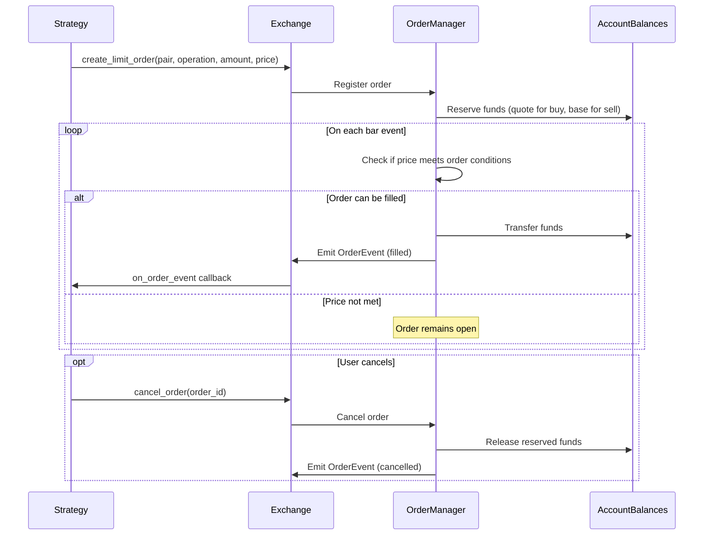
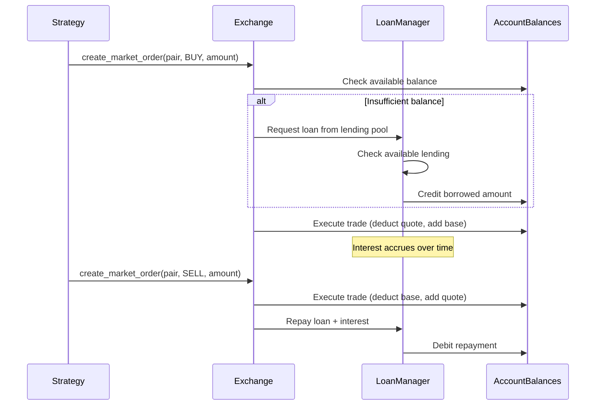

# Basana -- Workflow

## Backtesting Workflow



## Live Trading Workflow (Binance)



## Event Processing Pipeline



## Order Lifecycle



## Margin Trading Flow



## Historical Data Download

```bash
# Download Binance bars
python -m basana.external.binance.tools.download_bars \
  -c BTC/USDT -p 1h -s 2024-01-01 -e 2024-01-31 -o data.csv

# Download Bitstamp bars
python -m basana.external.bitstamp.tools.download_bars \
  -c BTC/USD -p 1h -s 2024-01-01 -e 2024-01-31 -o data.csv
```

---
## See Also
- [README](README.md) — Project overview and quick start
- [Architecture](architecture.md) — System design and components
- [State Management](state-management.md) — State lifecycle and data models
- [Development](development.md) — Development guide and best practices
